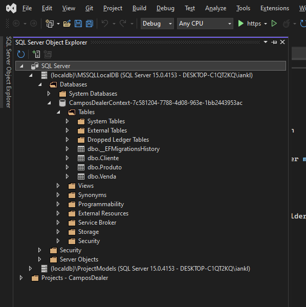
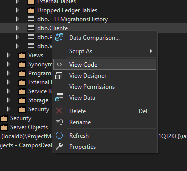
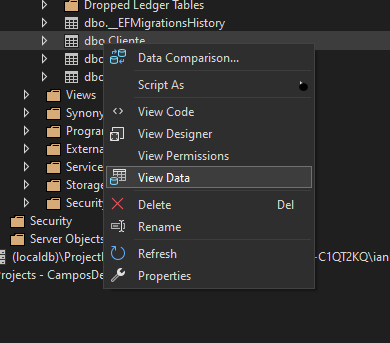

# Gerenciamento de Clientes, Produtos e Vendas utilizando .NET 8.0 com o padrão MVC e SQL Server

## Como executar o projeto

1. Clone o projeto utilizando o seguinte comando:
   ```bash
   git clone https://github.com/ianklapouch/CamposDealer.git 
   ```

2. Abra o projeto utilizando o Visual Studio.

3. No **Visual Studio**, no **Package Manager Console**, execute os seguintes comandos para a criação do banco de dados e das tabelas:
   ```bash
   Add-Migration InitialCreate
   ```
   ```bash
   Update-Database
   ```

## Observações

- A carga de dados pelos endpoints `https://camposdealer.dev/Sites/TesteAPI/...` é realizada pela classe **SeedData.cs**. As informações são inseridas na primeira execução do projeto. Devido às chaves estrangeiras **idCliente** e **idProduto** do endpoint `https://camposdealer.dev/Sites/TesteAPI/venda`, o banco precisa estar vazio para que os registros sejam inseridos sem violar as constraints de chave primária e estrangeira.

- Os campos **vlrUnitario (Produto)** e **vlrTotalVenda (Venda)** foram definidos como **decimal** em vez de **float**, conforme recomendado na [documentação](https://learn.microsoft.com/en-us/dotnet/csharp/language-reference/language-specification/types#838-the-decimal-type) para cálculos financeiros e monetários.

- O banco de dados SQL Server utilizado é do tipo **LocalDB**, padrão criado pelo Entity Framework Core quando não há um contexto de banco de dados na aplicação. Ele é usado como um banco de dados para desenvolvimento, configurado dessa forma para evitar problemas com o ambiente dos testadores e a necessidade de ajustar manualmente as connection strings.

## Como visualizar o banco de dados

Dentro do Visual Studio, na janela **SQL Server Object Explorer**, expanda o **LocalDB** -> **Databases** -> **CamposDealerContext** -> **Tables**.



Para visualizar o esquema das tabelas, clique com o botão direito na tabela e selecione a opção **View Code**.



Para conferir os dados, clique com o botão direito na tabela e selecione a opção **View Data**.



## Tecnologias utilizadas

- .NET 8.0
- Entity Framework Core
- SQL Server
- Bootstrap CSS
